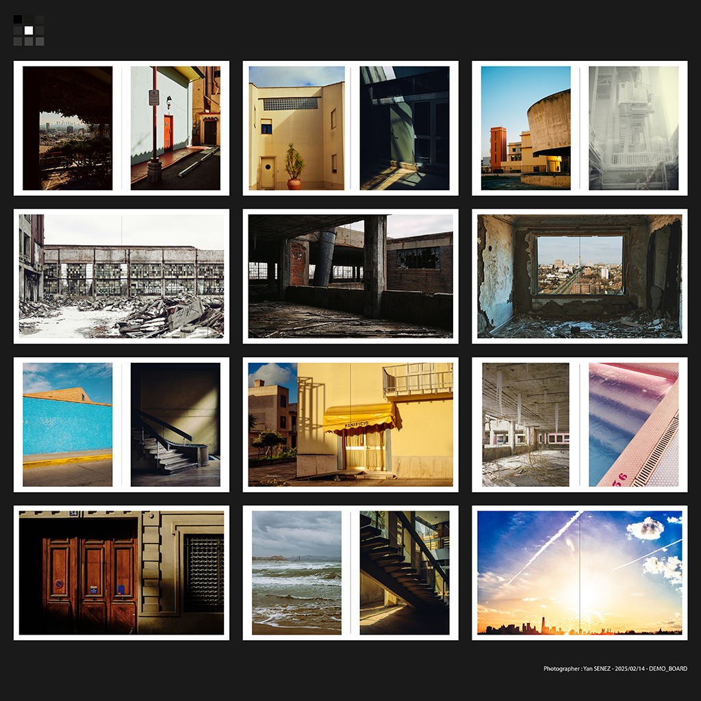
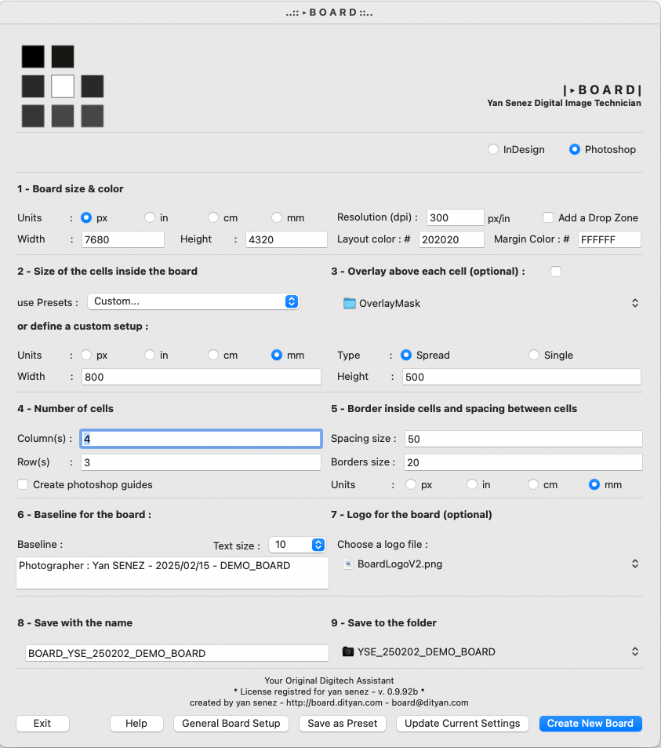

## YODA BOARD Overview
*"Always with you, what cannot be done. Hear you nothing that I say?"*

BOARD is the flagship tool in the YODA suite, revolutionizing the way digital technicians and photographers manage their visual workflow. Whether you call it a board, layout, moodboard, or contactsheet - the concept remains the same: maintaining a comprehensive overview of your shoot is crucial for ensuring consistency and creative coherence.

 

## Quick presentations videos :
- https://youtu.be/NLkbjuNyCMY
- https://youtu.be/JerVrLAY4qw
- https://youtu.be/r3Y_gpg4Rfc
- https://youtu.be/kpxVXmPDQuo

### Why BOARD Matters
During a photo shoot, maintaining a clear overview of your project is paramount. A well-organized board serves multiple critical purposes:
- Provides a comprehensive view of the entire shoot
- Ensures visual consistency across all images
- Creates a professional reference document for clients
- Helps track progress and identify gaps
- Facilitates communication between team members
- Supports creative decision-making in real time

### The Traditional Challenge
Traditionally, creating these layouts has been:
- Time-consuming and labor-intensive
- Requires switching between Capture One and other applications
- Prone to inconsistencies in formatting
- Interrupts the natural flow of the shoot
- Delays client feedback and approval processes
- Risk of errors in file organization and naming
- Difficulty in maintaining different versions
- Limited flexibility for quick adjustments

### The YODA BOARD Solution
*"Difficult to see. Always in motion is the future."*

BOARD transforms this process by:
- Integrating seamlessly with Capture One
- Eliminating the need to switch between applications
- Providing precise and consistent layout creation
- Dramatically reducing the time needed to create boards
- Maintaining workflow momentum during shoots

### Key Benefits
- **Advanced Organization**:
  * Automatic file naming and organization
  * Smart version control
  * Consistent formatting across all boards
  * Easy access to previous versions

- **Enhanced Creative Control**:
  * Real-time layout updates
  * Flexible cell arrangements
  * Multiple layout presets for different needs
  * Customizable masks and guides

- **Improved Client Experience**:
  * Professional and consistent presentation
  * Quick turnaround for client review
  * Easy comparison between different shots
  * Clear documentation of the shoot progress

- **Technical Advantages**:
  * High-resolution output
  * Color-accurate previews
  * Smart auto-placement features
  * Efficient use of system resources

- **Workflow Optimization**:
  * Reduced post-shoot organization time
  * Minimized risk of human error
  * Streamlined approval process
  * Better team coordination

### Impact on Production
The result? A significant boost in:
- Workflow efficiency
- Production quality
- Client communication
- Team coordination
- Creative focus
- Project organization
- Delivery speed
- Quality consistency

### Additional Benefits
- **Cost Efficiency**:
  * Reduced time spent on administrative tasks
  * Lower risk of errors requiring fixes
  * More time for creative work
  * Optimized resource utilization

- **Team Collaboration**:
  * Clear visual reference for all team members
  * Easy sharing of progress and updates
  * Consistent formatting across different users
  * Standardized workflow for multiple operators

## System Requirements
- macOS (compatible with recent versions)
- Xcode Command Line Tools installed
- Adobe Photoshop
- Capture One (highly recommended)
  * While technically optional, Capture One is strongly recommended for optimal workflow
  * Provides seamless integration with automatic image processing
  * Enables efficient image selection and export
  * Automatically creates required export recipes
  * Maintains consistent image quality and formatting
