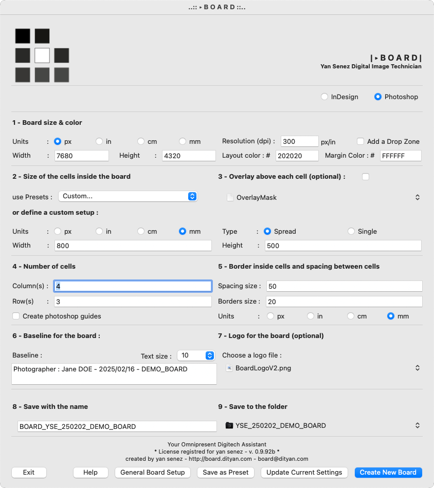
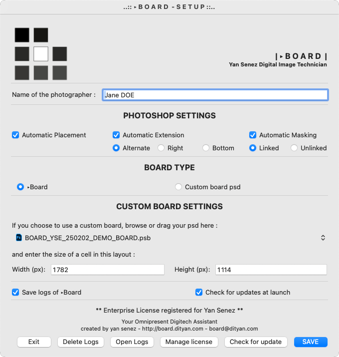
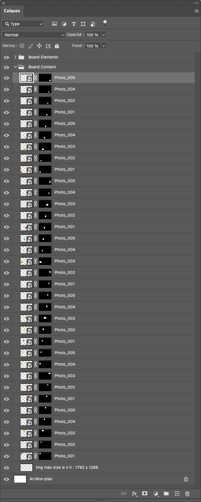

# ‣BOARD - Professional Layout Creator for Capture One

**‣BOARD helps you create professional layouts in Photoshop or InDesign directly from Capture One.**

## Table of Contents
- [Overview](#overview)
- [Key Features](#key-features)
- [Installation](#installation)
  - [System Requirements](#system-requirements)
  - [Installation Process](#installation-process)
  - [Security](#security)
- [Applications](#applications)
  - [BOARD Creator](#board-creator)
  - [BOARDing Exporter](#boarding-exporter)
- [Work Environments](#work-environments)
  - [Adobe Photoshop Workflow](#adobe-photoshop-workflow)
  - [Adobe InDesign Workflow](#adobe-indesign-workflow)
- [Privacy & Security](#privacy--security)
- [Documentation](#documentation)
  - [Video Tutorials](#video-tutorials)
  - [Layer Structure](#layer-structure)
- [Benefits & Impact](#benefits--impact)
  - [Workflow Benefits](#workflow-benefits)
  - [Team Collaboration](#team-collaboration)
  - [Client Experience](#client-experience)

## Overview

BOARD is a dedicated application for creating contact sheets (boards) directly integrated with Capture One. It allows you to set up sheet dimensions and populate them instantly from the Capture One browser, optimizing workflow while keeping a real-time eye on the entire shoot.

<h3 align="center">‣‣‣ <a href="https://github.com/Igrekess/BOARD/releases">Download the latest beta version here</a></h3>

  

Perfect for:
- Professional photographers
- Creative studios
- Advertising agencies
- Publishers
- Art directors

## Key Features
- Seamless Capture One integration
- Real-time layout updates
- Smart auto-placement
- Customizable layouts
- Version control
- Professional formatting
- High-resolution output

## Installation

### System Requirements

**Minimum:**
- macOS 10.15 (Catalina) or later
- Intel Core i7 processor
- 16GB RAM
- 1GB available disk space

**Recommended:**
- macOS 14.0 (Sonoma) or later
- Apple Silicon (M1 or later)
- 32GB RAM
- SSD storage with 1GB available space

### Installation Process

**Pre-requisites:**
- Compatible versions of Adobe Photoshop/InDesign and Capture One
- Xcode command line tools installed

**Automatic Installation:**
1. Download and run "Board installer.dmg" (https://github.com/Igrekess/BOARD/releases/tag/0.9.95)
2. Follow on-screen instructions
3. Set up shortcuts as guided

**Manual Installation:**
1. Install Xcode Command Line Tools if not present (in terminal):
			xcode-select --install

2. Copy application to correct locations:
* Copy BOARD.app to your Capture One script folder (https://github.com/Igrekess/BOARD/tree/main/releases/0.9.95)
* Ensure proper permissions:
chmod -R 755 /Library/Scripts/Capture One Scripts/BOARD.app
3. BOARDing.app will be created at the first launch of BOARD.app
4. Setup your shortcuts
* Open **System Preferences** and go to **Keyboard**.
* Select the Shortcuts tab, then click on **App Shortcuts** in the sidebar.
* Click the **+** button to add a new shortcut.
* In the Application dropdown, select **Capture One**.
* In the Menu Title field, type the exact name of the menu command you want to assign a shortcut to (e.g., "BOARD" & "BOARDing").
* In the Keyboard Shortcut field, press the key combination you’d like to use.
* Click **Add** to save the shortcut.

### Security
- Signed and notarized by Apple
- Compliant with macOS security requirements
- Trusted developer certificate
- Gatekeeper compatible

## Applications

### BOARD - Creator
- Layout design and setup
- Sheet dimension configuration
- Border and color customization
- Preset management
- Multiple layout options

### BOARDing - Exporter
- Direct Capture One integration
- Smart image placement
- Automatic cell population
- Dynamic layout extension
- Real-time progress monitoring

## Work Environments

### Adobe Photoshop Workflow
- Multilayer sheet creation
- Automatic masks and borders
- Dynamic sheet extension
- Drop zone functionality
- Advanced layer management

### Adobe InDesign Workflow
- Print-optimized documents
- Automatic master pages
- Text style management
- High-quality PDF export

## Privacy

**‣BOARD** now features enhanced offline capabilities. An internet connection is only required for the initial license validation. After this first authentication, the application automatically creates a secure cryptographic local license, enabling complete offline functionality. This local license system ensures uninterrupted workflow even without internet access, making BOARD fully operational in any working environment. All features, including contact sheet creation, Capture One integration, and Adobe CC workflows, remain fully functional offline. The application periodically checks for updates when internet is available but never requires online validation for normal operation after initial setup.
Privacy and Data Security: BOARD is designed with strict privacy in mind. The application does not collect, transmit, or store any user data, images, or usage information. The only server communication occurs during the initial license validation and optional update checks. All work remains entirely local on your machine, ensuring complete confidentiality of your creative projects.

## Documentation

### Video Tutorials
- [Basic Overview](https://youtu.be/NLkbjuNyCMY)
- [Advanced Features](https://youtu.be/JerVrLAY4qw)
- [Workflow Integration](https://youtu.be/r3Y_gpg4Rfc)
- [Tips & Tricks](https://youtu.be/kpxVXmPDQuo)

 

### Layer Structure

## Benefits & Impact

### Workflow Benefits
- Increased efficiency
- Reduced errors
- Faster delivery
- Better organization
- Enhanced creative focus

### Team Collaboration
- Standardized workflows
- Clear visual references
- Easy progress sharing
- Consistent formatting

### Client Experience
- Professional presentation
- Quick turnaround
- Clear documentation
- Streamlined approval process
